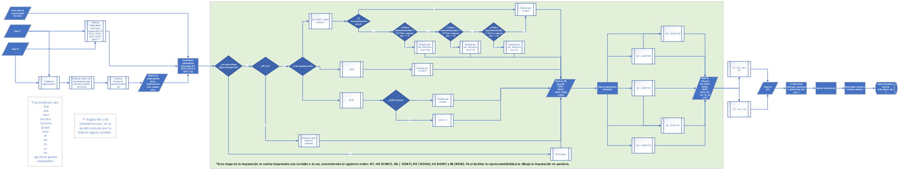
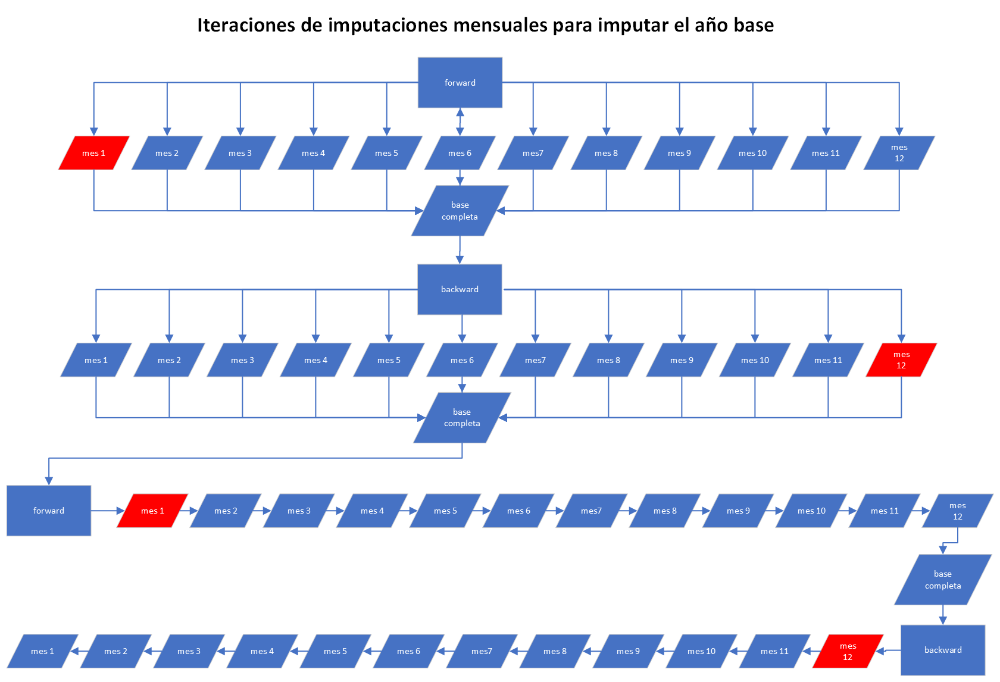

<!-- badges: start -->
<!-- badges: end -->

# Descripción

`emrclimputacionesespejo` es una colección de funciones diseñadas para imputar microdatos por medio de hotdeck, especialmente enfocado en datos de encuestas de remuneraciones y similares. Este paquete permite realizar imputaciones basadas en datos de periodos anteriores y calcular indicadores básicos relevantes para el análisis de remuneraciones y horas de trabajo.

## Instalación

Puedes instalar la versión de desarrollo de `emrclimputacionesespejo` desde [GitHub](https://github.com/) con:

``` r
if (!"devtools" %in% installed.packages()[,1]){install.packages("devtools")}
devtools::install_github("renzoperagallo/emrclimputacionesespejo")
```
## Instrucciones

Para imputar un año base, debe ejecutarse el siguiente código: 

``` r

# Archivo con los datos a imputar para todo los meses del año base.
base <- readxl::read_excel("./")
# Archivo con los mínimos y máximos para cada variable.
parametros <- readxl::read_excel("./")
# Archivo con los roles de comportamiento unico (debe ser un vector)
roles_unicos <- ...


base_imputada <- 
  imputar_ano_base(
  df = base,
  roles_comportamiento_unico = roles_unicos,
  n_cadenas_minimas = 4
  ) |> 
  aplicar_restrucciones(
  microdato_original = base,
  parametros = parametros
  ) |> 
  round_microdatos(
  decimales_truncado = 6
  decimales_redondeo = 0
  )

``` 

Como se puede ver, existen tres funciones aplicadas para imputar la base. La primera de ellas realiza la imputación y tiene como resultado la base imputada (sin NAs, salvo excepciones) con valores decimales. La segunda función  trunca los valores imputados a mínimos y máximos para cada variable (NT, HONT, ROHO, OGNT, HENT y REHE) según parámetros dados. La tercera función redondea los datos a valores enteros para cada variable, intentado conservar las razones previas. 

Para llevar a cabo la imputación se requieren 3 archivos: La base imputada, un data frame con los parámetros mínimos y máximos para cada mes  y un vector con los roles de comportamiento único. Para ver un ejemplo de cada una de estas variables, se puede ejecutar el siguiente código: 

``` r
ejemplo_microdato_mes_t_na
ejemplo_parametros
ejemplo_roles_comportamiento_unico
```
En el caso de los parámetros, si se requiere que una variable especifica no tenga limitación de mínimos o máximos, se puede definir cada uno de estos valores como Inf o -Inf según corresponda. 

Si no se requiere imputar roles de comportamiento único, se puede dejar esta variable como NULL. 

## Funciones Principales

El paquete emrclimputacionesespejo incluye varias funciones clave:

`imputar_mes()`: Imputa los microdatos para la encuesta de remuneraciones del mes T, utilizando datos de hasta tres meses anteriores.

`imputacion_cab()`: Imputa un año de 12 meses con la metodología de imputación definida para el cambio de año base en la Encuesta de Remuneraciones.

`aplicar_restricciones()`: Función que aplica las restricciones de mínimos y máximos sobre los **valores imputados** de la base. 

`round_microdatos()`: Función que redondea los valores finales de la imputación a números enteros. 

`calculo_nivel_representatividad()`: Calcula el nivel de representatividad de las agregaciones deseadas en un conjunto de datos.

`imputar_parametro()`: Imputa valores para una columna específica en un conjunto de datos, basándose en la representatividad y variabilidad.

`calculador_indicadores_basicos()`: Calcula indicadores básicos derivados de variables específicas en un conjunto de datos.

`imputar_rehe()`: Imputa la variable rehe por medio de arrastre. 

`imputar_hent()`: Imputa la variable hent por medio de arrastre. 


## Esquema del paquete

La función 'imputar_ano_base' es una función anidada  y su estructura se presenta  en  el siguiente esquema: 


## Metodología de imputación

La metodología completa de imputación se describe en el [Manual Metodológico de la Encuesta de Remuneraciones año base 2023](enlace).

Adicionalmente, se aportan dos esquemas de flujo que permiten entender los flujos de la imputación: 

### Esquema de la imputación mensual

 

### Iteraciones de imputaciones mensuales para imputar el año base

 

## Contribuciones
Las contribuciones a emrclimputacionesespejo son bienvenidas. Por favor, consulta las instrucciones de contribución para más detalles.

## Licencia
Este paquete está disponible bajo la licencia MIT. Consulta el archivo LICENSE para más información.
